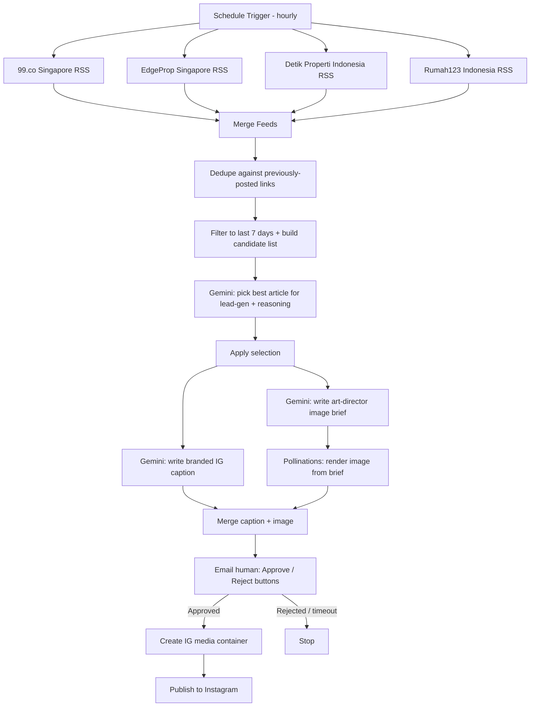

# Rumah123 Weekly IG Post Generator

An n8n workflow that watches Southeast Asian property news (Jakarta + Singapore), picks the single article most likely to generate real estate leads, and turns it into a branded Instagram post — AI-written Bahasa Indonesia caption, AI-generated on-brand image, human email approval with Approve/Reject buttons, then auto-publish to Instagram.

Built as a submission for the **Tool/Workflow Building** task ("Weekly IG Post Generator: Auto-generate Instagram posts from latest Property news").

## What it does, end to end

1. **Pulls property news** every hour from 4 RSS feeds (2 Singapore, 2 Indonesia).
2. **Filters to the last 7 days** and **dedupes** against articles already posted (so nothing repeats).
3. **Picks the single best article for lead-gen** — not just the newest one. A Gemini call reasons over all candidates and explains, in Bahasa Indonesia, why it picked the one it did (e.g. a policy change beats a generic "how to mop your floor" evergreen post).
4. **Writes the caption** — Gemini, briefed as a Rumah123 social copywriter: casual Bahasa Indonesia, hook line, comment-bait CTA, `#Rumah123 #RumahUntukSemua` hashtag rule, natural brand mention.
5. **Generates the image** — Gemini, briefed as a Rumah123 art director, invents a scenario tied to the article and writes an image prompt matching Rumah123's real ad style (moody navy-blue interior, warm lamp glow, one genuinely smiling subject holding a symbolic prop). The prompt is rendered via Pollinations.ai (free, keyless image generation).
6. **Emails a human for approval** — n8n's built-in Send-and-Wait node, with real Approve/Reject buttons, the reasoning for why this article was picked, the caption, and the image.
7. **On approval**, publishes directly to Instagram via the Graph API (create media container → publish). On rejection or timeout, it stops — nothing goes live unreviewed.

## Architecture

## Files in this repo

- `workflow.json` — the full n8n workflow, export-ready (Settings → Import from File in n8n).
- `PROMPTS.md` — every AI prompt used, as literal text, plus a sample of real output.
- `BUILD_LOG.md` — a first-person account of building this: what broke, what I changed, what I'd do differently.
- `sample-output-image.jpg` — a real image generated by the pipeline for a real article (see PROMPTS.md for the article + caption that went with it).

## Stack

- **n8n** (self-hosted, local) — orchestration
- **Gemini** (`gemini-flash-latest`) — article selection reasoning, caption writing, image-prompt writing
- **Pollinations.ai** — free, no-key image generation
- **Gmail SMTP** — approval email
- **Instagram Graph API** (via a Facebook Page + Instagram Business account) — publishing

## Setup (to run this yourself)

1. Import `workflow.json` into an n8n instance.
2. Create 3 credentials in n8n and attach them to the matching nodes:
   - **Header Auth** named however you like, header `x-goog-api-key` = your Gemini API key → attach to the 3 Gemini HTTP Request nodes.
   - **SMTP** with your sender email + an app password → attach to the Email Approval node, and set `toEmail` to whoever should approve posts.
   - **Header Auth**, header `Authorization` = `Bearer <your long-lived Instagram Page access token>` → attach to the two `graph.facebook.com` nodes, and replace the Instagram Business Account ID in both node URLs with your own.
3. Getting the Instagram token requires: an Instagram Business account, a linked Facebook Page, a Meta Developer App with the Instagram product's "Publish content" and "Access profile info" use cases enabled, and a Graph API Explorer token exchanged for a long-lived Page token. This part is entirely manual on Meta's side — see `BUILD_LOG.md` for the exact permission scopes that were actually required (Meta's docs undersell this).
4. Activate the workflow.

## Known limitations (see BUILD_LOG.md for the full story)

- The image is a clean AI photo only — no text/logo/CTA button is baked into the pixels (Pollinations can't reliably render small legible text). A production version would add a compositing step (n8n's built-in Edit Image node, or a hosted HTML-to-image service) to overlay the headline, CTA pill, and logo the way Rumah123's real ads do.
- The approval email's one-click Approve/Reject links are plain GET links. During testing, one of these got triggered automatically within ~60 seconds of the email being sent, without a human clicking anything — publishing a post with no real review. This is documented in detail in `BUILD_LOG.md` along with the fix I'd apply.
